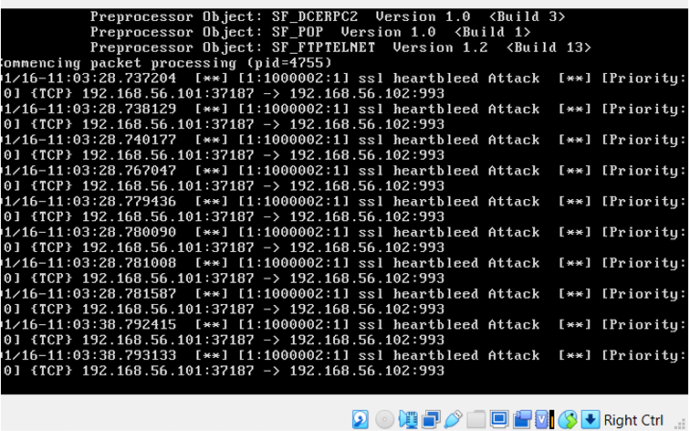
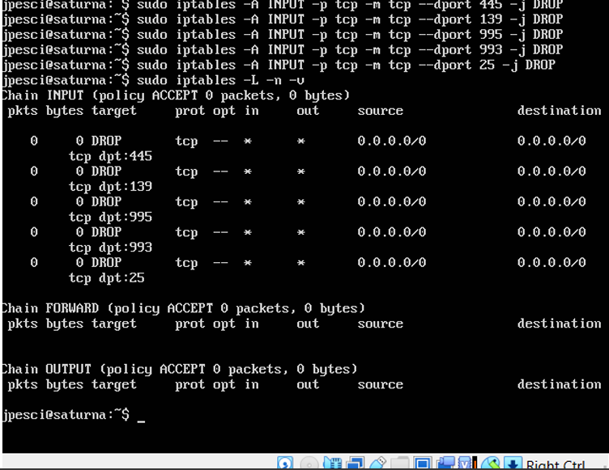

# Network_Security_Defense
Network security project using Snort IDS and iptables firewall

##  Overview
This project focuses on implementing network defense mechanisms using intrusion detection and firewall configurations in a controlled lab environment.

##  Tools Used
- Snort (IDS)
- iptables (Firewall)
- Kali Linux
- Metasploit
  
##  What I Did
- Configured Snort to detect suspicious and malicious traffic
- Developed custom Snort rules for monitoring attacks
- Implemented firewall rules using iptables
- Simulated attacks to test detection and response

##  Key Outcomes
- Detected malicious traffic using IDS
- Blocked unauthorized access using firewall rules
- Improved network security through layered defense approach

##  Screenshots

### Snort Alerts

### Firewall Rules

##  Full Report
[View Full Report](./screenshots/attack-test.png)

## ⚠️ Disclaimer
This project was conducted in a controlled lab environment for educational purposes only.
